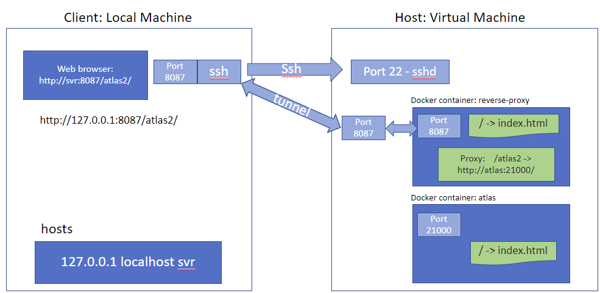
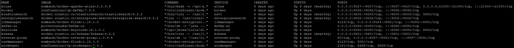
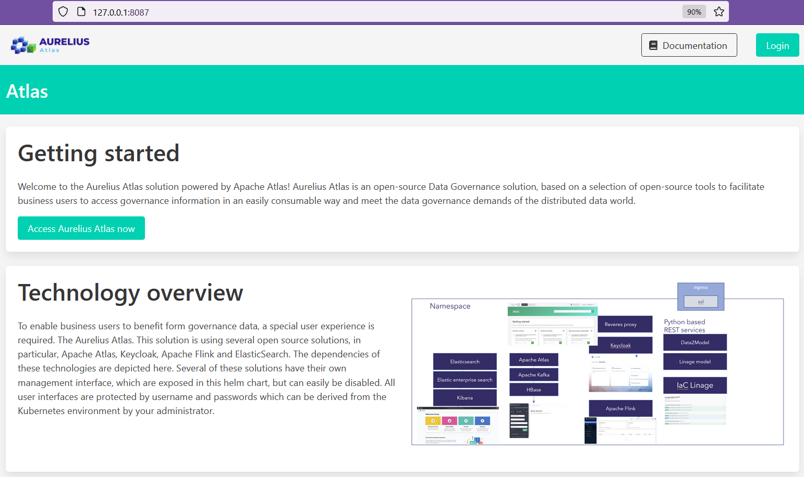

How to deploy Aurelius Atlas with Docker Compose
================================================
.. _docker_compose_deployment:

Getting started
=======================
Welcome to Aurelius Atlas, a powerful data governance solution powered by Apache Atlas! Aurelius Atlas leverages a carefully curated suite of open-source tools to provide business users with seamless access to governance information. Our solution is designed to address the evolving demands of data governance in a distributed data environment, ensuring that you can easily consume and utilize valuable governance insights.

This guide provides comprehensive instructions for setting up the Docker Compose deployment and covers various deployment scenarios. You will find step-by-step instructions to configure the required setup and deploy the system.

Description of system
=======================

The solution is based on Apache Atlas for metadata management and governance, and Apache Kafka is utilized for communicating changes in the system between different components. A Kafka Web based user interface is made accessible to have easy access to the Apache Kafka system for maintenance and trouble shooting. Additionally, an Apache server is implemented to handle and distribute frontend traffic to the corresponding components. A custom interface has been developed to enable effective search and browsing functionality using full-text search capabilities, leveraging the power of the Elastic stack. This stack includes Elasticsearch, Enterprise Search, and Kibana. Keycloak serves as the identity provider implementing Single Sign On functionalty for all Web based user interfaces. Apache Flink is used to facility the creation of metadata to support the search functionality. Thus, Apache Flink runs streaming jobs that consume Kafka events from Apache Atlas and create metadata in Elastic Enterprise Search. 

Hardware requirements
=======================
- 4 CPU cores 
- 32GB RAM 
- 100GB DISK

Installation Requirements
===========================

To deploy this solution you will need to install the following components:

- docker
- docker compose

Please ensure that you have these components installed on both the host and client machines for a successful deployment

How to connect to the docker-compose environment?
===================================================
For the client a local machine is required and for the host a VM or local machine can be used. Below we describe some possible scenarios for this deployment

Deployment on local machine
==============================
No additional action is required

Deployment on VM with public domain name
===========================================
Connect to the VM using as destination its public IP

Deployment on VM without public domain name
==============================================

In this deployment situation, a VM is used further referred to as Host and a client, whcih can be directly accessed by the user.

In this scenario the following additional components are required:

Host:
- ssh server

Client:
- ssh client

To achieve connectivity with the Host and the Client the following steps have to be taken:

- From the client Connect to the Host using as destination the hosts IP address 

- Define a ssh tunnel from the client to the host for port 8087

.. code:: bash

	8087 -> 127.0.0.1:8087

- Extend hosts file on the client with the following line (admin right required)

.. code:: bash

	127.0.0.1       localhost localhost4 $EXTERNAL\_IP

This is a representation of the described deployment on VM:
 

	

Preparatory Steps:
====================

On the host:

1. Start docker (admin rights required):

.. code:: bash

	sudo service docker start

2. Obtain the IP address or hostname of the host machine's eth0 interface:
	
- If deployment is on local machine:

.. code:: bash

	export EXTERNAL\_IP=$(ifconfig eth0 | grep 'inet' | cut \-d: \-f2 | sed \-e 's/.\*inet \\([^ ]\*\\).\*/\\1/')

- If deployment is on a VM:

.. code:: bash

	export EXTERNAL\_IP={hostname of VM}

3. Run the following script:

.. code:: bash

	./retrieve\_ip.sh

This script updates the values of `$EXTERNAL\_IP` within the templates used to generate the necessary configuration files for the various services.

4. Grant Elasticsearch sufficient virtual memory to facilitate its startup (admin rights required):

.. code:: bash

	sudo sysctl \-w vm.max\_map\_count=262144

For more details on configuring virtual memory for Elasticsearch, refer to the elastic documentation `page <https://www.elastic.co/guide/en/elasticsearch/reference/8.2/vm\-max\-map\-count.html>`__

Environment variables responsible for user/pass
==================================================

By default these roles are created in the different services:

- Elastic Admin User:  
	Username: elastic  

	Password: elasticpw

- Keycloak Admin user:  
	Username: admin  

	Password: admin

- Aurelius/Apache Atlas Admin User:  
	Username: atlas  

	Password: 1234

Spin up docker-compose environment:
=====================================
 
To start up the system, execute the following command on the host.

.. code:: bash

	docker compose up -d

Starting up the system may take several minutes. 

This is how the system looks in operational state:

When the Apache Atlas container state changes from starting to healthy, then the system is ready.

You are able now to access Aurelius Atlas at thw client wiht the URL `http://$EXTERNAL_IP:8087/`

You can find more information about the product in this `page <https://www.aurelius-atlas.com/docs/doc-technicall-manual/en/dev/Options/what.html>`_

Notes:
==========

- How to restart Apache Atlas?
.. code:: bash

	docker exec -it atlas /bin/bash
	cd /opt/apache-atlas-2.2.0/bin/
	python atlas_stop.py
	python atlas_start.py

- How to restart reverse proxy?
.. code:: bash

	docker exec -it reverse-proxy /bin/bash
	apachectl restart

