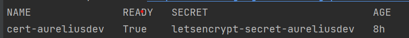

Azure Deploy Aurelius Atlas
============================
.. _azure-deployment:

Getting started
---------------

Welcome to the Aurelius Atlas solution powered by Apache Atlas! Aurelius
Atlas is an open-source Data Governance solution, based on a selection
of open-source tools to facilitate business users to access governance
information in an easy consumable way and meet the data governance
demands of the distributed data world.

Here you will find the instillation instructions and the required setup
of the kubernetes instructions, followed by how to deploy the chart in
different namespaces.

Installation Requirements
-------------------------

This installation assumes that you have:

- a kubernetes cluster running with 2 Node of CPU 4 and 16GB

- Chosen Azure Cli installed

  - `az <https://learn.microsoft.com/en-us/cli/azure/install-azure-cli>`_

- kubectl installed and linked to Azure Cli

  - `az linked <https://learn.microsoft.com/en-us/azure/aks/learn/quick-kubernetes-deploy-cli#connect-to-the-cluster>`_

Further you need the helm chart to deploy all services from https://github.com/aureliusenterprise/Aurelius-Atlas-helm-chart

Required Packages
-----------------

The deployment requires the following packages:

- Certificate Manager
   - To handel and manage the creation of certificates
   - Used in demo: cert-manager

- Ingress Controller
   - Used to create an entry point to the cluster through an external IP.
   - Used in demo: Nginx Controller

- Elastic
   - Used to deploy elastic on the kubernetes cluster
   - In order to deploy elastic, ``Elastic Cluster on Kubernetes (ECK)`` must be installed on the cluster. To install ECK on the cluster, please follow the instructions provided on https://www.elastic.co/guide/en/cloud-on-k8s/master/k8s-deploy-eck.html

- Reflector
   - Used to reflect secrets across namespaces
   - Used in demo to share the DNS certificate to different namespace

The steps on how to install the required packages
~~~~~~~~~~~~~~~~~~~~~~~~~~~~~~~~~~~~~~~~~~~~~~~~~

1. Install Certificate manager
''''''''''''''''''''''''''''''

Only install if you do not have a certificate manager. Please be aware
if you use another manger, some commands later will need adjustments.
The certificate manager here is
`cert-manager <https://cert-manager.io/docs/installation/helm/>`_.

.. code:: bash

   helm repo add jetstack https://charts.jetstack.io
   helm repo update
   helm install  cert-manager jetstack/cert-manager   --namespace cert-manager   --create-namespace   --version v1.9.1 --set installCRDs=true

2. Install Ingress Nginx Controller
'''''''''''''''''''''''''''''''''''

Only install if you do not have an Ingress Controller.

.. code:: bash

   helm repo add ingress-nginx https://kubernetes.github.io/ingress-nginx
   helm repo update
   helm install nginx-ingress ingress-nginx/ingress-nginx --set controller.publishService.enabled=true --set controller.service.annotations."service\.beta\.kubernetes\.io/azure-load-balancer-health-probe-request-path"=/healthz

It is also possible to set a DNS label to the ingress controller if you do not have a DNS by adding ``--set controller.service.annotations."service\.beta\.kubernetes\.io/azure-dns-label-name"=<label>``

3. Install Elastic
''''''''''''''''''

.. code:: bash

   kubectl create -f https://download.elastic.co/downloads/eck/2.3.0/crds.yaml
   kubectl apply -f https://download.elastic.co/downloads/eck/2.3.0/operator.yaml

4. Install Reflector
''''''''''''''''''''

.. code:: bash

   helm repo add emberstack https://emberstack.github.io/helm-charts
   helm repo update
   helm upgrade --install reflector emberstack/reflector

Azure DNS Label
--------------------
In Azure, it is possible to apply a DNS label to the ingress controller, if you do not have a DNS.

Edit the ingress controller deployment (if not set upon installation)

..  code:: bash

    helm upgrade nginx-ingress ingress-nginx/ingress-nginx --reuse-values --set controller.service.annotations."service\.beta\.kubernetes\.io/azure-dns-label-name"=<label>

Save and exit. Resulting DSN will be
``<label>.westeurope.cloudapp.azure.com``

Put ssl certificate in a Secret
-------------------------------

Before you start, update zookeeper dependencies:

..  code:: bash

    cd charts/zookeeper/
    helm dependency update

Define a cluster issuer
-----------------------

This is needed if you installed cert-manager from the required packages.

Here we define a CLusterIssuer using cert-manager on the cert-manager
namespace

#.  Move to the home directory of the chart helm-governance
#.  Uncomment templates/prod_issuer.yaml.
#.  Update the ``{{ .Values.ingress.email_address }}`` in values.yaml file and create the ClusterIssuer with the following command

    ..  code:: bash

        helm template -s templates/prod_issuer.yaml . | kubectl apply -f -

#. comment out prod_issuer.yaml in templates Check that it is running:

    ..  code:: bash

        kubectl get clusterissuer -n cert-manager

#. It is running when Ready is True.

    .. image:: ../imgs/letsencrypt.png

Create ssl certificate
----------------------

This is needed if you installed cert-manager from the required packages.

#.  Assumes you have a DNS linked to the external IP of the ingress controller
#.  Move to the home directory of the chart helm-governance
#.  Uncomment templates/certificate.yaml
#.  Update the values.yaml file ``{{ .Values.ingress.dns_url}}`` to your DNS name
#.  Create the certificate with the following command

    ..  code:: bash

        helm template -s templates/certificate.yaml . | kubectl apply -f -

#.  Comment out certificate.yaml in templates.
#.  Check that it is approved.

    ..  code:: bash

        kubectl get certificate -n cert-manager

It is running when Ready is True

Deploy Aurelius Atlas
---------------------

#.  Create the namespace
   ..   code:: bash

        kubectl create namespace <namespace>

#.  Update the values.yaml file

    *   ``{{ .Values.keycloak.keycloakFrontendURL }}`` replace it to your DNS name
    *   ``{{ .Values.post_install.upload_data }}`` set to `"true"` if you want to upload sample data after installation, otherwise set to `"false"`

#.  Deploy the services
   ..   code:: bash

        cd Aurelius-Atlas-helm-chart
        helm dependency update
        helm install --generate-name -n <namespace>  -f values.yaml --wait --timeout 15m0s .

Users with Randomized Passwords
~~~~~~~~~~~~~~~~~~~~~~~~~~~~~~~

In the helm chart 5 base users are created with randomized passwords
stored as secrets on kubernetes.

The 5 base users are:

1. Keycloak Admin User
2. Atlas Admin User
3. Atlas Data Steward User
4. Atlas Data User
5. Elastic User

To get the randomized passwords out of kubernetes there is a bash script
get_passwords.

.. code:: bash

   ./get_passwords.sh <namespace>

The above command scans the given ``<namespace>`` and prints the
usernames and randomized passwords as follows:

::

   keycloak admin user pwd:
   username: admin
   vntoLefBekn3L767
   ----
   keycloak Atlas admin user pwd:
   username: atlas
   QUVTj1QDKQWZpy27
   ----
   keycloak Atlas data steward user pwd:
   username: steward
   XFlsi25Nz9h1VwQj
   ----
   keycloak Atlas data user pwd:
   username: scientist
   PPv57ZvKHwxCUZOG
   ==========
   elasticsearch elastic user pwd:
   username: elastic
   446PL2F2UF55a19haZtihRm5
   ----

Check that all pods are running
-------------------------------

.. code:: bash

   kubectl -n <namespace> get all # check that all pods are running

Aurelius Atlas is now accessible via reverse proxy at
``<DNS-url>/<namespace>/atlas/``

Enable social login
~~~~~~~~~~~~~~~~~~~

To enable social login in Aurelius Atlas, please follow the steps below:

1. Register an OAuth 2.0 client application with Google, GitHub or Facebook. (To see the full list please `keycloak website <https://www.keycloak.org/>`__) This will be used as an identity provider in Keycloak.

   - `google <https://keycloakthemes.com/blog/how-to-setup-sign-in-with-google-using-keycloak>`__
   - `github <https://medium.com/keycloak/github-as-identity-provider-in-keyclaok-dca95a9d80ca>`__
   - `facebook <https://medium.com/@didelotkev/facebook-as-identity-provider-in-keycloak-cf298b47cb84>`__

2. Update values file ``{{ .Values.keycloak.realm_file_name }}`` to ``realm_m4i_with_provider.json``
3. Within ``charts/keycloak/realms/realm_m4i_with_provider.json``, replace the client ID and secret with your own credentials:
   - Place your Client ID into: ``identityProviders.config.clientSecret``
   - Place your Client secret into : ``identityProviders.config.clientId``

If your deployment is already running, you can enable the identity provider through the Keycloak UI:
- Navigate to the Keycloak administration console.
- Click "Identity providers" in the menu, then choose the desired provider from the dropdown menu.
- Set the Client ID and Client Secret. The rest of the settings can remain default.

Loading Sample Demo Data (Optional)
-----------------------------------

A sample dataset can be automatically loaded. Ensure that the ``post_install.upload_data`` variable is set to true in the values file.

For more details about this look at:

- Atlas Post Install: `link <https://github.com/aureliusenterprise/atlas-post-install>`__
- Aurelius Atlas - Flink: `link <https://github.com/aureliusenterprise/flink-ci>`__
