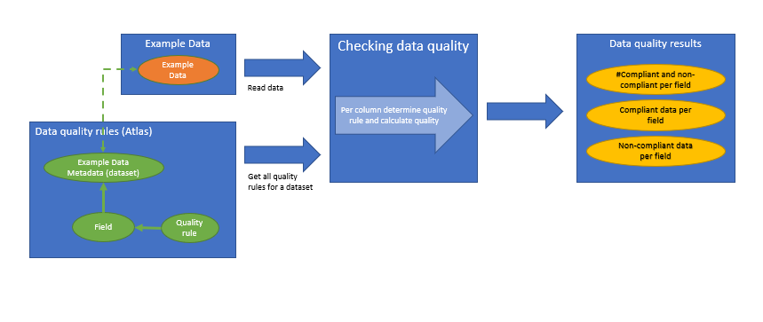

Data Quality
==============

Data quality refers to the overall fitness for use of data. It describes the degree to which data meets the requirements of its intended use, which can vary depending on the context, application, and user. 
Evaluating data quality ensures that the data is reliable, relevant, and actionable, and can help identify areas for improvement in data collection, storage, and management processes. 
Ultimately, the goal of data quality management is to ensure that data can be trusted and used effectively to support decision-making, analysis, and other business processes.
Since actual data is required for this assessment, this analysis can not be done in Aurelius Atlas itself, but is performed on the related data storage system. The quality results however,
can be documented in Aurelius Atlas. This documentation contains the checked rules as well as the actual data quality compliance results.

Data quality results are then propagated along the breadcrumb of the field to datasets, collections and systems on the technical side and to data attributes, data entities and data domains on the business side.

Conceptual view
---------------

Thus, conceptually data quality results can be added in Aurelius Atlas. It consists of 3 parts:

* the actual data quality result
*  an associated data quality Atlas entity
*  a field which is associated with the quality result 

Data quality result
~~~~~~~~~~~~~~~~~~~

Data quality result consists of multiple fields:

* a unique ID, which can be human readable
* a qualityguid, which is a guid of the actual quality result	
* a data quality result (dqscore), which is a boolean value of 0 or 1, where 0 mean 0% compliance and 1 means 100% compliance

Data quality rule
~~~~~~~~~~~~~~~~~

A data quality rule is described in Aurelius Atlas as type data quality rule. Currently you can not enter this quality rule via the front end.

A data quality rule consists of :

* name: of the associated rule
* description: explaining the thought behind the rule
* expression: which is constructuced from an expression language on the level of the data quality 
* business rule ID: which is usually just a number used for ordering the rules when presented in the front end
* dimension 

+----------------+-------------------------------------------------------------+
| Rule Category  | Rule Description                                            |
+================+=============================================================+
| completeness   | degree to which data is not null                            |
+----------------+-------------------------------------------------------------+
| accuracy       | degree to which a column conforms to a standard             |
+----------------+-------------------------------------------------------------+
| validity       | degree to which the data comply with a predefined structure |
+----------------+-------------------------------------------------------------+
| uniqueness     | degree to which the data has a unique value                 |
+----------------+-------------------------------------------------------------+
| timeliness	 | the data should be up to date                               |
+----------------+-------------------------------------------------------------+

Associated field
~~~~~~~~~~~~~~~~~

A field can be used in multiple data quality rules, thus a field may have multiple data quality results of different data quality rule dimensions. A field is referenced by the following information:

* qualified name of the field used for the assessment
* fieldguid, that is the guid of the referenced field
* qualified field name

Technical view
--------------

Technically, data quality is represented in Aurelius Atlas as an Apache Atlas entity and as data in the metadata store (elastic app search).
The field as well as a description of the data quality rule are entities in Aurelius Atlas, while the actual data quality result is stored as metadata in elastic app search.

Data quality result
~~~~~~~~~~~~~~~~~~~

The data quality result in elastic app search is stored in the atlas-dev-quality engine. An example of the required documents is shown below. It contains all the conceptual elements explained in the previous section.

.. code-block:: javascript

	{
		"id": "nl3--nl3plant--nl3plant001--workorderid--8",
		"fields": [{
				"name": "id",
				"value": "nl3--nl3plant--nl3plant001--workorderid--8",
				"type": "enum"
			}, {
				"name": "fieldqualifiedname",
				"value": "nl3--nl3plant--nl3plant001--workorderid",
				"type": "string"
			}, {
				"name": "fieldguid",
				"value": "21f89d8f-4e10-4419-b135-6a84d55ed63f",
				"type": "string"
			}, {
				"name": "qualityguid",
				"value": "61484c0e-89db-49ff-a67a-2e3bb2e9219c",
				"type": "string"
			}, {
				"name": "dataqualityruledescription",
				"value": "This field has to be filled at all times",
				"type": "string"
			}, {
				"name": "expression",
				"value": "Completeness('workorderid')",
				"type": "string"
			}, {
				"name": "dqscore",
				"value": "1.0",
				"type": "float"
			}, {
				"name": "dataqualityruledimension",
				"value": "Completeness",
				"type": "string"
			}, {
				"name": "businessruleid",
				"value": "8.0",
				"type": "float"
			}, {
				"name": "name",
				"value": "Rule 8",
				"type": "string"
			}, {
				"name": "guid",
				"value": "61484c0e-89db-49ff-a67a-2e3bb2e9219c",
				"type": "string"
			}, {
				"name": "qualityqualifiedname",
				"value": "nl3--nl3plant--nl3plant001--workorderid--8",
				"type": "string"
			}, {
				"name": "datadomainname",
				"value": "plant data",
				"type": "string"
			}
		]
	}

Data quality rules
~~~~~~~~~~~~~~~~~~~~

Data quality rules are Apache Atlas entities, which can not be entered via the Aurelius Atlas frontend at the moment. We are working on it.

The entity contains the required fields as properties, such that they referential integrity between data quality results and the data quality rule entity are guaranteed.
An example of a data quality rule entity in json format as it is stored in Apache Atlas is shown below.

.. code-block:: javascript

	{
		"referredEntities": {},
		"entity": {
			"typeName": "m4i_data_quality",
			"attributes": {
				"expression": "completeness('HIER_ORG')",
				"qualifiedName": "nl1--nl1hr--nl1hr001--hier_organization--30",
				"displayName": null,
				"description": null,
				"active": true,
				"businessRuleDescription": "",
				"ruleDescription": "This field has to be filled at all times",
				"name": "nl1--nl1hr--nl1hr001--hier_organization--30",
				"filterRequired": true,
				"id": 30,
				"qualityDimension": "Completeness",
				"expressionVersion": "1",
				"fields": [{
						"guid": "0df94338-1afc-455c-b9d5-c3d0e36d1dac",
						"typeName": "m4i_field",
						"uniqueAttributes": {
							"qualifiedName": "nl1--nl1hr--nl1hr001--hier_organization"
						}
					}
				]
			},
			"guid": "3059989c-364d-4404-92ef-c1e719014f00",
			"isIncomplete": false,
			"relationshipAttributes": {
				"fields": [{
						"guid": "0df94338-1afc-455c-b9d5-c3d0e36d1dac",
						"typeName": "m4i_field",
						"entityStatus": "ACTIVE",
						"displayText": "HIER_ORGANIZATION",
						"relationshipType": "m4i_data_quality_field_assignment",
						"relationshipGuid": "35b3502c-38a7-4524-b266-2fd46888e5f2",
						"relationshipStatus": "ACTIVE",
						"relationshipAttributes": {
							"typeName": "m4i_data_quality_field_assignment"
						}
					}
				],
			},
		}
	}

The relationship attribute fields is referencing the related field. The remaining values are local to the entity and some of them are referenced and/or taken over in the data quality result data structure.

Propagation of data quality results
~~~~~~~~~~~~~~~~~~~~~~~~~~~~~~~~~~~~

After creating the data quality rule entity in Apache Atlas and data quality results in the metadata store, the data quality is accessible at the field. 
To propagate data quality results through the complete governance tree, currently there is a script required which can be called periodically. 
In a later version of Aurelius Atlas, all changes to data quality or the governance structures in Aurelius Atlas will also propagate data quality results.
A description on how to setup the script and how to run it will follow shortly.

Definitions of data quality rules
~~~~~~~~~~~~~~~~~~~~~~~~~~~~~~~~~~~

They are located at the m4i-data-management repository `quality rules <https://gitlab.com/m4i/m4i-data-management/-/tree/Athanasios/m4i_data_management/core/quality/rules>`_
You can find all the data quality rules, that you wish to apply on a dataset. They are explanations of each rule and examples on how to use them.
These are they data quality rules that are applied on a dataset.

Below is a brief description of each rule.

.. _Bijacency:

.. raw:: html

    <a href="https://gitlab.com/m4i/m4i-data-management/-/tree/Athanasios/m4i_data_management/core/quality/rules/bijacency" style="display: none">Bijacency</a>
 

+----------------------------+-----------------------------------------------------------------+
| Rule                       | Description                                                     |
+============================+=================================================================+
|                            |                                                                 |
|:ref:`Bijacency<Bijacency>` | Checks whether or not the values in the given `column_a` and    |
|                            | `column_b` only occur as a unique combination.                  |
+----------------------------+-----------------------------------------------------------------+
|                            |                                                                 |
| Compare first              | Checks whether the first 'number_of_characters' values in       |
| characters                 | `first_column_name` and `second_column_name` are similar, and if|
|                            | the values are None or NaN.                                     |
+----------------------------+-----------------------------------------------------------------+
|                            |                                                                 |           
| Compare first              | Checks whether the first 'number_of_characters' values starting |
| characters                 | without in `first_column_name` and `second_column_name` are     |
| starting without           | similar, and if `column_name` does not start with any of the    |
|                            | given `prefixes`, and if the values are None or NaN.            |
+----------------------------+-----------------------------------------------------------------+
|                            |                                                                 |
| Completeness               | Checks whether the values in the column with the given          |
|                            | `column_name` are None or NaN.                                  |
+----------------------------+-----------------------------------------------------------------+
|                            |                                                                 |
| Conditional                | Checks whether or not the values in the given `value_column`    |
| completeness               | are `None` or `NaN`.                                            |
+----------------------------+-----------------------------------------------------------------+
|                            |                                                                 |
| Conditional                | Checks if values in the column with the given `value_column`    |
| unallowed text             | contain a specific unallowed `text`.                            |
+----------------------------+-----------------------------------------------------------------+
|                            |                                                                 |
| Conditional value          | Checks whether the values in the given `value_column` match     |
|                            | (one of) the expected value(s) for a given key in the           |
|                            | `key_column`.                                                   |
+----------------------------+-----------------------------------------------------------------+
|                            |                                                                 |
| Contains                   | Checks how many times the values in the column with the given   |
| character                  | `column_name` contain a specific character.                     |
+----------------------------+-----------------------------------------------------------------+
|                            |                                                                 |
| Formatting                 | Checks whether or not the values in the column with the given   |
|                            | `column_name` match the given `pattern`.                        |
+----------------------------+-----------------------------------------------------------------+
|                            |                                                                 |
| Invalidity                 | Checks whether or not the values in the column with the given   |
|                            | `column_name` does not exist in the given list of `values`.     |
+----------------------------+-----------------------------------------------------------------+
|                            |                                                                 |
| Length                     | Checks if the number of characters of the values in the column  |
|                            | with the given `column_name` are equal to the `required_length`.|
+----------------------------+-----------------------------------------------------------------+
|                            |                                                                 |
| Range                      | Checks whether or not the values in the column with the given   |
|                            | `column_name` are:                                              |
|                            | - Greater than or equal to the given `lower_bound`.             |
|                            | - Less than or equal to the given `upper_bound`.                |
+----------------------------+-----------------------------------------------------------------+
|                            |                                                                 |
| Starts with                | Checks whether or not the values in the column with the given   |
|                            | `column_name` start with any of the given `prefixes`.           |
+----------------------------+-----------------------------------------------------------------+
|                            |                                                                 |
| Unallowed text             | Checks if values in the column with the given `column_name`     |
+----------------------------+-----------------------------------------------------------------+
|                            |                                                                 |
| Uniqueness                 | Checks whether the values in the column with the given          |
|                            | `column_name` are unique (duplicate value check).               |
+----------------------------+-----------------------------------------------------------------+
|                            |                                                                 |
| Validity                   | Checks whether or not the values in the column with the given   |
|                            | `column_name` exist in the given list of `values`.              |
+----------------------------+-----------------------------------------------------------------+
|                            |                                                                 |
| Cross-Column               | Checks whether or not the combination of values in the given    |
| Validity                   | `first_column_name` and `second_column_name` exist in the given |
|                            | list of valid `value_combinations`.                             |
+----------------------------+-----------------------------------------------------------------+

Data Quality Rules and Examples
--------------------------------

1. Bijacency
~~~~~~~~~~~~

In this example, a dummy dataset is provided and the columns "id" and "name" are compared.

    
A dummy data set is seen in the code
First run a test to see if the columns are bijacent. The columns "id" and "name" are compared.
    
    .. code-block:: python
            

            data = DataFrame([
                {
                    "id": 1234,
                    "name": "John Doe",
                    "function": "Developer",
                    "from": "01-01-2021"
                },
                {
                    "id": 1234,
                    "name": "John Doe",
                    "function": "Senior developer",
                    "from": "01-01-2022"
                }
                            ])

            result =  bijacency(data, "id", "name") 

This is the function that we are using: bijacency(df, "column_a", "column_b"). The inputs are the dataset and the column names.

The id and name are the same in this example, which means they are bijacent. The output will be 1.

2. Compare First characters
~~~~~~~~~~~~~~~~~~~~~~~~~~~~

Checks whether the first 'number_of_characters 'values in `first_column_name` and `second_column_name` are similar, and if the values are None or NaN.

A dummy dataset is provided and the first two characters of the id and name will be compared.

 
 .. code-block:: python

        data = DataFrame([
                {
                    "id": "NL.xxx",
                    "name": "NL.xxx",
                }
                        ])

        result = compare_first_characters(data, "id", "name", 2)

This is the function used in this example: compare_first_characters(df, "column_a", "column_b", num_char). The inputs are the dataset,the column names and the number of characters.   
      
3. Check First Characters using Prefix
~~~~~~~~~~~~~~~~~~~~~~~~~~~~~~~~~~~~~~~

This rule does three checks. It checks if the first characters are the same, if the have same prefix and if the values are Nan or none.

A dummy dataset with two columns, id and name is provided

 .. code-block:: python

    data = DataFrame([
            {
                "id": "BE.xxx",
                "name": "BE.xxx",
             }         ])
        
   

    result = compare_first_characters_starting_without(data, "id", "name", 2, 'BE')

A prefix BE is used and the function is

	compare_first_characters_starting_without(data, "id", "name", 2, 'BE')

we provide the dataset we are using, the column names, the number of characters we want to compare and the prefix.
The output will be 1, because the charaters are the same and have the prefix too.
    

4. Check Completeness
~~~~~~~~~~~~~~~~~~~~~

Checks whether the values in the column with the given `column_name` are None or NaN. 
    
    
We provide a data dummy test in the unit test and we want to check if the column 'name' has a value or not. If it has a value the
function will return 1, otherwise it will return 0
    
    .. code-block:: python
                
                data = DataFrame([
                    {
                        "id": 1234,
                        "name": NaN,
                        "function": "Developer",
                        "from": "01-01-2021"
                    }
                                 ])

                result = completeness(data, "name")

 This is the function. The inputs are data and the name of the column we want to check.
     
	 completeness(df, "column")
 
 The output here will be 0, because the column 'name' has no value in it.

5. Check Conditional Completeness
~~~~~~~~~~~~~~~~~~~~~~~~~~~~~~~~~

The columns "value" and "conditional" are 'None' or 'NaN'. The rows are filtered,
where the value of the 'key_column', is not a substring of the given value in the function. In this example the key column in "conditional"
and we are seeing if it has a substring of the list values.
 .. code-block:: python
        
        
        values = ['.TMP', '.FREE']
        ['.TMP', '.FREE']
            data = DataFrame([
                {
                    "value": "Something",
                    "conditional": "xx.FREE.eur"
                }
            ])

            result = conditional_completeness(data, "conditional", "value", values)

This is the function of use. The inputs are data, the name of the columns and the list of given values.

conditional_completeness(df, "column_a", "column_b",[list])

The output here will be 1, because they are no empty values in the columns and the column "conditional" has substrings of the given 
values = ['.TMP', '.FREE']

6. Check Unallowed Text
~~~~~~~~~~~~~~~~~~~~~~~

The check here is to see if there is unalllowed text in the columns of the dummy dataframe. 

 .. code-block:: python
            
            values = ['.TMP', '.FREE']

            unallowed_text_item = "("

            data = DataFrame([
                {
                    "value": "Something",
                    "conditional": "xx.FREE.eur"
                }
            ])

            result = conditional_unallowed_text(data, "conditional", "value", values, unallowed_text_item)

This is the function used for this example. The inputs are is the dataframe, the name of the two columns, the values of the substrings and the unallowed text.

    conditional_unallowed_text(df, "column_a", "column_b", [list_of_values], "string")

The output will be 1 because it containf substrings in the 'conditional'  column and doesn't contain the unalloed text in column "Value". If it did the output would be 0.

7. Check Conditional Value
~~~~~~~~~~~~~~~~~~~~~~~~~~

The 'value' and 'conditional' column are being checked to see if it contains the expected values of the 'key' values object.
  .. code-block:: python
        
        values = {"xx.TMP": "XX No Grade"}    (this is dictionary with it's key and value)

        data = DataFrame([                    (this is our dummy dataset)
            {
                "value": "XX No Grade",
                "conditional": "xx.TMP"
            }
        ])

        result = conditional_value(data, "conditional", "value", values) 

This is the function used for this example. The inputs are data of the dummy dataset, the names of the columns which are "value" and "conditional" and the values, that are the substrings we want to check.
    
    result = conditional_value(df, "column_a", "column_b", {dictionary})

The output here will 1, because "value" column, contains an expecetd value. Otherwise it would be 0.

8. Check Character Count
~~~~~~~~~~~~~~~~~~~~~~~~~

Checks how many times the values in the column with the given `column_name` contain a specific character. 

A dummy dataframe is provided with one column called "id". 
  
  .. code-block:: python
        
        data = DataFrame([
                {
                    "id": "12.12"
                }
            ])

        result = contains_character(data, "id", ".", 1) 

This is the function used in this example. The inputs are data, name of the column, the character we want to check and 1 is the expected count
    
    contains_character(df, "column", "string", int)  

The check performed here is to if the the id contains "." . The output will be 1 because the "id" column contains "."

9. Check Matching Pattern
~~~~~~~~~~~~~~~~~~~~~~~~~

Checks if the values in the column `name` match the given `pattern`.

A dummy dataset is provided

 .. code-block:: python
            
            data = DataFrame([
                    {
                        "name": 'ExampleText'
                    }
                ])

            result = formatting(data, "name", r'^[a-zA-Z]+$')

This is the function used for this example. The inputs are the dataset,the column "name" and the pattern to see if it matches 

formatting(df, "column", expression_pattern)

The ouput will be 1 in this example, because 'ExampleText' matches the pattern.

10. Check Invalidity
~~~~~~~~~~~~~~~~~~~~

The values in the column with the given name `value` are checked if they do not exist in the given list of `exampleValues`.

A list of the example values and a dummy dataframe are provided.

.. code-block:: python
        
        
        exampleValues = ['x', 'X', 'TBD', 'Name']

        data = DataFrame([
                {
                    "value": "X"
                }
            ])

        result = invalidity(data, "value", exampleValues)

The funtion is called invalidity. The inputs are data, column name and the list of values.

    invalidity(df, "column", [list])

The output will be 1 , becaue "X" is in the list of values.

11. Check Length
~~~~~~~~~~~~~~~~

The check performed here is the number of characters of the values in the column `id` are equal to the `required_length`. 

A dummy dataframe with column name "id"

 .. code-block:: python

        data = DataFrame([
                {
                    "id": "1234"
                }
            ])

        result = length(data, "id", 4)

The function is called length. The inputs are data, column name and the length of required characters.
    
    length(df,"column",int)

The output is 1 because the length of id is 4.

12. Check Range
~~~~~~~~~~~~~~~

The check performed here is the values in the column  `column_name` are greater than or equal to the given `lower_bound` or less than or equal to the given `upper_bound`.

A dummy dataframe for this example with column name "value"

.. code-block:: python
 
        
        data = DataFrame([
                {
                    "value": 0.1
                }
                         ])

        result = range(data, "value", 0, 1)

The function is called range. The inputs are the dataframe, the column name and the range (The upper and lower bound)

    range(df, "column", int1, int2)

The output will be 1 because 0.1 is between 0 and 1.

13. Check Prefix
~~~~~~~~~~~~~~~~

This example checks if the values in the column `column_name` start with any of the given `prefixes`.

.. code-block:: python

        data = DataFrame([
                {
                    "id": 1234
                }
                         ])

        result = starts_with(data, "id", "1")

The function is called starts_with. The inputs are the data the column name and the prefix.

    starts_with(data, "column", "prefix")

The output is 1, because "1" is in the value of the id column.
    

14. Check Unallowed Text
~~~~~~~~~~~~~~~~~~~~~~~~

This example checks if the values in the column `Organisation` contain a specific unallowed `text`.

A dummy dataset is provided.

 .. code-block:: python

        
        data = DataFrame([
            {
                "Organisation": "Something Else"
            }
        ])

        result = unallowed_text(data, "Organisation", "BG Van Oord")

The function is called unalllowed_text. The inputs are data, the column name and the unallowed text

    unallowed_text(df, "column", "sting")

The output is 1 because "BG Van Oord" is not in the "Something Else" of the "Organisation" column.

15. Check Uniqueness
~~~~~~~~~~~~~~~~~~~~

This example checks  if the values in the column `id` are unique. It checks for duplicate values

A dummy dataset is provided

 .. code-block:: python

            
            data = DataFrame([
                    {
                        "id": "1234"
                    },
                    {
                        "id": "1234"
                    },
                    {
                        "id": "2345"
                    }
                            ])

            result = uniqueness(data, "id")

The function is called uniqueness. The inputs are the dataset and the name of the column.
    
    uniqueness(data, "id")

The output will be 0, because the "id" column conatins duplicate values

16. Check Validity
~~~~~~~~~~~~~~~~~~

This example checks if the values in the column `value` exist in the list of exampleValues.

The values in the example list and a dummy dataset are provided

 .. code-block:: python

        exampleValues = ['Definite Contract', 'Indefinite Contract']

        data = DataFrame([
                {
                    "value": "Definite Contract"
                }
                        ])
            
        result = validity(data, "value", exampleValues)

The function is called validity. The inputs are data, the column name and the list of example values.

    validity(df, "key",[list])

The output is 1, because the value of the column exists in the example list.

Apply Data Quality Results
---------------------------

The tool checks the quality of your data. To use it, you need to provide a csv file with your data and the rules you want to apply to it. The rules are basically the type
of checks you want to do on the attributes of your dataset. The rules you want to define are stored, on Aurelius Atlas and is used to apply the rules to your data.
The quality score of your data is calculated based on the applied rules and the results are sent to a Kafka topic. 
Below is an image that describes the whole process for your better understanding.

1. First upload a file, define the rules that we want to apply to the data. Then push this file to atlas.
2. Then get the data quality rules from atlas and see the data quality results. The quality results have a data quality score. 1 is compiant and 0 is non-compliant
3. Finally push the data quality results to kafka.

How To Perform A Data Quality Check Of Your Data
~~~~~~~~~~~~~~~~~~~~~~~~~~~~~~~~~~~~~~~~~~~~~~~~~~~

Here is a link of the repositories you will need:

     https://github.com/aureliusenterprise/m4i_atlas_core

     https://gitlab.com/m4i/m4i-data-management

Install M4I Data Management
~~~~~~~~~~~~~~~~~~~~~~~~~~~~

This library contains all core functionality around data management.

Installation 

Please ensure your `Python` environment is on version `3.7`. Some dependencies do not work with any later versions of `Python`.

To install `m4i-data-management` and all required dependencies to your active `Python` environment, please run the following command from the project root folder:

To install `m4i-data-management` including development dependencies, please run the following command instead:

pip install -e .[dev]

Install m4i_data_management:
You can clone m4i_data_management from this link https://gitlab.com/m4i/m4i_data_management
Then you install with this command

pip install {path to m4i_data_management}
 

Do the same for m4i_atlas_core

pip install {path to m4i_atlas_core}
 

Please make a copy of `config.sample.py` and `credentials.sample.py` and rename the files to `config.py` and `credentials.py` respectively.

The `config.py` and `credentials.py` files should be located in the root folder of the project, or otherwise on the `PYTHON_PATH`.

Please remember to set the configuration parameters you want to use.

How to set up config and credentials file
~~~~~~~~~~~~~~~~~~~~~~~~~~~~~~~~~~~~~~~~~~

Here is the exact configuration of the config and credentials, use this to run the example.

.. code-block:: python

    config = {
        "atlas_dataset_guid": "f686adca-00c4-4509-b73b-1c51ae597ebe",
        "dataset_quality_name": "example_name",
        "atlas": {
            "atlas.server.url": "https://aureliusdev.westeurope.cloudapp.azure.com/anwo/atlas/atlas",
        },
        "keycloak.server.url": "https://aureliusdev.westeurope.cloudapp.azure.com/anwo/auth/",
        "keycloak.client.id": "m4i_public",
        "keycloak.realm.name": "m4i",
        "keycloak.client.secret.key": ""
    }

    credentials = {
        "keycloak.credentials.username": "atlas",
        "keycloak.credentials.password": "",
        "atlas.server.url":"https://aureliusdev.westeurope.cloudapp.azure.com/anwo/atlas/atlas", 
        "atlas.credentials.username":"atlas",
        "atlas.credentials.password":""
    }

How to run data quality check
~~~~~~~~~~~~~~~~~~~~~~~~~~~~~~

Our tool checks the quality of your data. To use it, you need to provide a csv file with your data and the rules you want to apply to it. The rules are basically the type of checks you want to do on the attributes of your dataset. We store your data and rules on Atlas and use our tool to apply the rules to your data. We then calculate the quality score of your data based on the applied rules and provied a csv output with the results.

These are the steps on how to do it
    
    

    
    1. In the run_quality_rules.py we can now run our check. We have to provide a dataset so we can do a quality check.
       Fill in the path in the get_data_csv(). You will see it on line 63. Make a csv file with example data. Here is a simple example below.

       Just One Column named UID and provide a name. Make an excel file.

       UID
       example_name

    
    2. Finally we run our check in the run_quality_rules.py In debug mode run the 'asyncio.run(atlas_dataset_quality.run())' it's on line 59

How to create entities and relationships
~~~~~~~~~~~~~~~~~~~~~~~~~~~~~~~~~~~~~~~~~

In the create_push_to_atlas.py a user can create a dataset, field and data quality rule entity and push it to atlas. He can create a relationship between the field and dataset. I will explain how to do it with an example.

1. Define the attributes for each instance

Define the attributes for the dataset instance

 .. code-block:: python

        json_dataset={
            "attributes": {
                "name": "example",
                "qualifiedName": "example100"
            },
            "typeName": "m4i_dataset"
            }

Define the attributes for the field instance

 .. code-block:: python

        json_field={
            "attributes": {
                "name": "field",
                "qualifiedName": "example--field"
            },
            "typeName": "m4i_field",
            "relationshipAttributes": {
                "dataset": {
                    "guid": "<guid-of-json_dataset>",
                    "typeName": "m4i_dataset",
                    "relationshipType": "m4i_dataset_fields"
                }
            }
        }

Define the attributes for the data quality instance

 .. code-block:: python

        json_quality={
            "attributes": {
                "name": "field",
                "qualifiedName": "example--quality",
                "id": 1
            },
            "typeName": "m4i_data_quality"
            }

2. Create instances 

Create instances of BusinessDataset, BusinessField, and BusinessDataQuality

.. code-block:: python
        json_str = json.dumps(json_dataset)
        dataset_instance = BusinessDataset.from_json(json_str)

        json_str1 = json.dumps(json_field)
        field_instance= BusinessField.from_json(json_str1)

        json_str2 = json.dumps(json_quality)
        quality_instance = BusinessDataQuality.from_json(json_str2)

3. Add relationship between the field and dataset instances

.. code-block:: python

    field_attributes=field_instance.attributes
    field_attributes.datasets= [ObjectId(
                type_name="m4i_dataset",
                unique_attributes= M4IAttributes(
                qualified_name="example100"
            )
            )]

4. Push the entities to atlas.

We use the create_entities function that can be found in the m4i_atlas_core. It is important to undertstand what are the inputs.
create_entites(dataset_instance,referred_entites,accesss_token). The first input is the instance we created, then the referred entities, which here are non because we are just creating an entity with no relationships and finally the access token.

Push the dataset instance to Atlas

     .. code-block:: python

        async def create_in_atlas(dataset,access_token=access_token):
            mutations_dataset = await create_entities(dataset,referred_entities=None,access_token=access_token)
            print(mutations_dataset)
        push_to_atlas= asyncio.run(create_in_atlas(dataset_instance,access_token=access_token))

Push the field instance to Atlas

     .. code-block:: python

        async def create_in_atlas_field(field,access_token=access_token):
            mutations_field = await create_entities(field,field,referred_entities=None,access_token=access_token)
            print(mutations_field)
        push_field = asyncio.run(create_in_atlas_field(field_instance,access_token=access_token))

Push the data quality instance to Atlas

     .. code-block:: python

        async def create_in_atlas_rule(rule,access_token=access_token):
            mutations_rule = await create_entities(rule,referred_entities=None,access_token=access_token)
            print(mutations_rule)
        push_rule = asyncio.run(create_in_atlas_rule(rule,access_token=access_token))

Here is a link to the git, click `here. <https://gitlab.com/m4i/m4i-data-management/-/blob/Athanasios/quality_rules.md>`_

        

